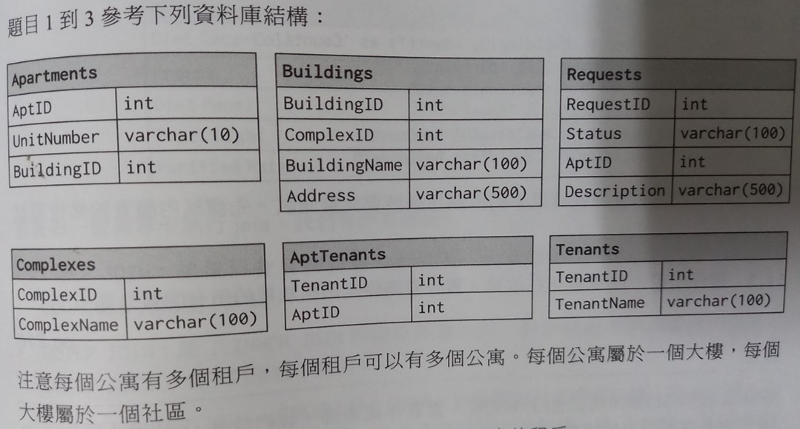
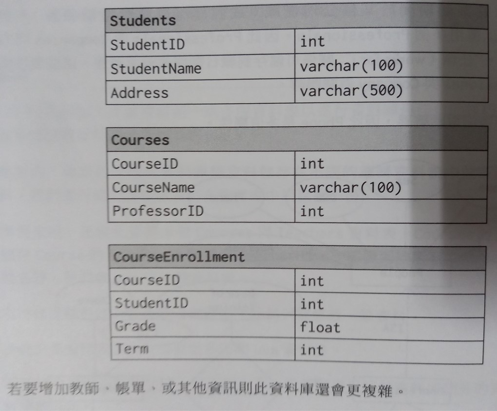

# CH14. Database

## 14.1 多個公寓: 撰寫 SQL 查尋已列出承租多個公寓的租戶。

```sql=
select TenantName
from Tenants
Inner Join
    (select TenantID 
    from AptTenants 
    Group by TenantID
    Having count(*)>1) C
On Tenants.TenantID=C.TenantID
```
## 14.2 出租: 撰寫 SQL 查詢列出樓與閒置公寓數量(status為'Open')

```sql=
select BuildingName, ISNULL(Count,0) as 'Count'
from Buildings
Left Join
    (select Apartments.BuildingID, count(*) as 'Count'
    from Requests
    Inner Join Apartments
    On Requests.AptID = Apartments.AptID
    where Requests.Status = 'Open'
    Group by Apartments.BuildingID) ReqCounts
On ReqCounts.BuildingID = Buildings.BuildingsID
```

### 14.3 暫停出租: 11號樓正在改建。實作查詢停止出租該樓的所有閒置公寓。

```sql=
Update Requests
Set Status='Closed'
where AptID IN 
    (Select AptID
    from Apartments
    where BuildingID=11)
```

### 14.7 設計成績資料庫:有個資料庫儲學生成績。設計此資料庫與回傳好學生(前 10%)的SQL查詢，依績排序。

```sql=
DECLARE @GPACutOff float;
Set @GPACutOff=
(Select min(GPA) as 'GPAMin' 
from(
    select top 10 PERCENT AVG(CourseEnrollment.Grade) as GPA
    from CourseEnrollment
    Group by CourseEnrollment.StudentID
    Order by GPA desc) Grades);
```

```sql=
select StudentName, GPA
from(
    select AVG(CourseEnrollment.Grade) as GPA, CourseEnrollment.StudentID
    from CourseEnrollment
    Group by CourseEnrollment.StudentID
    Having AVG(CourseEnrollment.Grade)>=@GPACutOff) Honors
Inner join Students
on Honors.StudentID=Students.StudentID
```